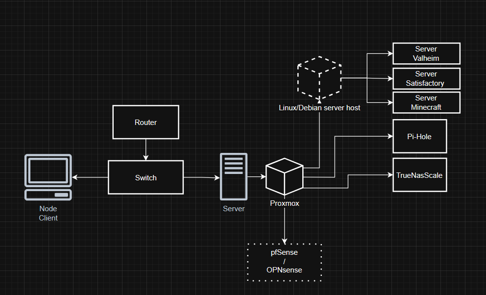

# Homelab NAS – Proxmox + ZFS + Samba

## Overview
This project implements a high-availability NAS environment inside a Proxmox homelab. The goal was to design a storage backbone that’s fault-tolerant, simple to maintain, and scalable for self-hosted services like Immich and Jellyfin. The setup emphasizes practical automation, data safety, and reproducible documentation.

## Purpose 
This project series began as a way to repurpose my old hardware into something practical, a NAS and game server environment for me, friends and my fellow students.
Along the way, I discovered Proxmox and the benefits of virtualization, which opened the door to building a more flexible and efficient setup than a standard Windows-based host.
As the system grew, I transitioned fully to Linux for stability and scalability, expanded storage with new drives, and began planning future integrations like Immich for photo management.

##Goals
- Reliable storage with disk redundancy  
- Access from multiple devices (Windows and Linux)  
- Use snapshots for quick restore of files and datasets 
- Support image backups of VMs and containers
- Serve as a stable foundation for additional services (e.g. Immich, Jellyfin) 

## UML


## Architecture
**Hardware:** 
- CPU: i9-9900K, 
- RAM: 64GB 
- Disks: 2×8TB HDD (NAS), 2×2TB HDD (photo backup), 250GB SSD (OS/VM)
- GPU: Nvidia 1070TI
- PSU: Corsair 750W
  

**Software and services:**  
| Hostname | Type | OS | CPU | RAM | Disk | Comment |
|-----------|------|----|-----|-----|------|------------|
| `proxmox01` | Hypervisor | Proxmox VE 8.x | i9-9900K | 64 GB | 2 TB SSD | Mainserver |
| `truenas01` | NAS / files | TrueNAS SCALE | 4 vCPU | 16 GB | 2x8TB, 2x2TB ZFS | SMB, NFS, Backups |
| `docker01` | VM | Ubuntu 22.04 | 4 vCPU | 8 GB | 100 GB |  containers |
| `immich01` | Container | Ubuntu 22.04 | 4 vCPU | 6 GB | 20+2TB | Photo storage |
| `pihole01` | Container | Debian | 1 vCPU | 512 MB | 2 GB | DNS filtering |
| `Netdata ` | Container | Debian | 2 vCPU | 1 GB | 10 GB | 🧭TBD🧭|
| `BitWarden` | Container | Debian | 2 vCPU | 2 GB | 20 GB | 🧭TBD🧭 |
| `Syncthing` | Container | Debian | ? vCPU | ? GB | ?? GB | 🧭TBD🧭 |
| `Portainer` | Container | Debian | ? vCPU | ? GB | ?? GB | 🧭TBD🧭 |
| `Tailscale` | Container | Debian | ? vCPU | ? GB | ?? GB | 🧭TBD🧭 |
| `Nextcloud` | Container | Debian | ? vCPU | ? GB | ?? GB | 🧭TBD🧭 |
| `Jellyfin` | Container | Debian | ? vCPU | ? GB | ?? GB | 🧭TBD🧭 |


## Repository Structure

```
homelab-nas/
│
├─ README.md              ← Main project overview (this file)
├─ docs/
│   ├─ timeline.md       ← Chronological project log (dates, milestones)
│   ├─ config.md          ← Configuration examples (Proxmox VM, ZFS pool, SMB)
│   └─ errors-fixes.md    ← Problems encountered and solutions
└─ images/
    ├─ truenas-pool.png   ← Screenshot: ZFS pool status
    ├─ smb-shares.png     ← Screenshot: SMB share setup
    └─ network-diagram.png← Architecture diagram
```

## What I Learned
- Hands-on experience setting up and managing ZFS mirrors 
- Using datasets and snapshots for data organization and protection  
- Configuring Samba shares and managing ACLs for different users
- Running self-hosted services (Immich, Jellyfin) integrated with the NAS  
- Building a complete backup strategy with snapshots + VM image backups
- Backup automation (vzdump, rsync, rclone)
- Documentation and infrastructure-as-code practices

## Next Steps
- Implement encrypted offsite backup with rclone  
- Add alerts in Grafana (Discord/Telegram/webhooks)  
- Evaluate SSD/NVMe caching for better NAS performance  


## Scope and Considerations
Some enterprise-level features (e.g. advanced monitoring, network segmentation) were considered but excluded to keep the system manageable for a homelab of this size.
These remain possible extensions for future iterations.  


A detailed project report can be found here:  
👉 [PROJECT_REPORT.md](./PROJECT_REPORT.md)

## ohh, and 
I bought this little thing to try networking or perhaps as offsite backup. Anything can happen. 


